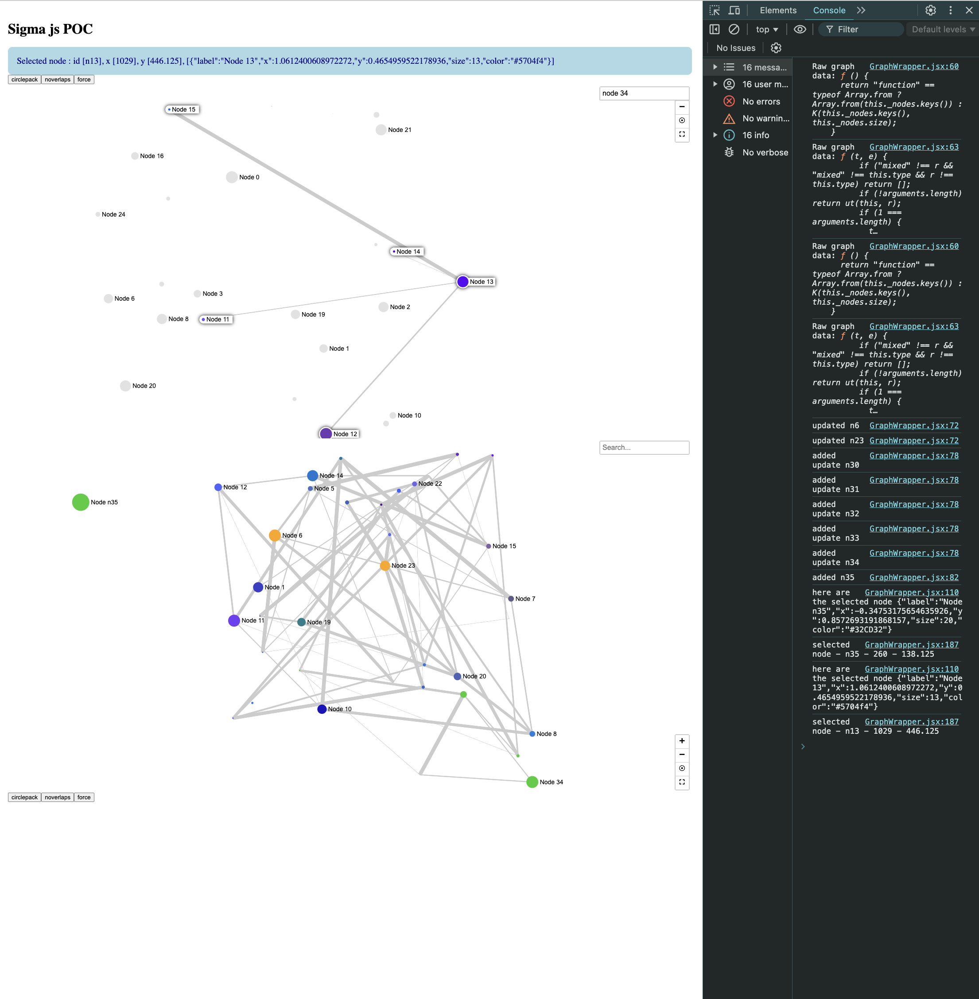

## Overview 

nothing serious here but the idea is to see how to create a Web UI (based on [sigmajs](https://www.sigmajs.org) and [react-sigma](https://sim51.github.io/react-sigma/)) to visualise graphs assuming an REST API that wraps backends like [memgraph](https://memgraph.com), [neo4j](https://neo4j.com) or even [Amazon Neptune](https://aws.amazon.com/neptune/). Indeed generally speaking all these technologies provide you with visualizers or you can plug a jupyter notebook but this has implications on the architecture compared to a classical Web UI calling REST APIs. 

Note that REST APIs are mocked with `/public/graph*.json`, called from the Web UI via [axios](https://github.com/axios/axios)

It basically 
* load a graph
* play with layout
* allow drag & drop of nodes
* get the selected node information

## generate the graph 

assuming you need to generate a graph (to update the current `/public/graph*.json`), you can use this [graph generator](https://github.com/omallassi/graph-generator)

## start

`npm start` will do the job 

